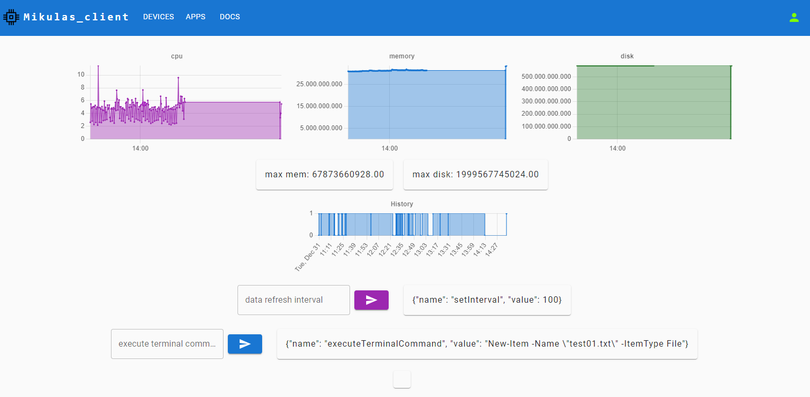

# Sensordata-WebSocket

# Node js publisher client for the api.sensordata.space websocket server

Serves as an example publisher/subscriber to demonstrate the capabilities of the sensordata.space platform.

## Examples
Check out the [examples](./examples/) folder for detailed usage scenarios:

- **Basic Usage**: [basic-usage.js](./examples/basic-usage.js)
- **Advanced Usage**: [advanced-usage.js](./examples/advanced-usage.js)

**Run locally**
```sh
npm install
npm run dev
```

**Run in docker**
```sh
docker build -t socketclient .
docker run --restart=always -p 3000:3000 --name socketclientcontainer socketclient 
```

Log in to [ui.sensordata.space](https://ui.sensordata.space) on the same network to view the device and device data.

The application connects as a sensordata "publisher/subscriber iot device to the  `api.sensordata.space` through secure websockets. Uses the SocketClient.js client to send data to the api.sensordata.space. Accepts and executes powershell commands and live configuration changes.

- Sends resource usage telemetry - cpu, memory and disk
- Accepts and executes powershell terminal commands
- Accepts and changes the data refresh rate frequency

**An example dashboard**

Dashboard json is [here](./dashboard/dashboard.json) 


